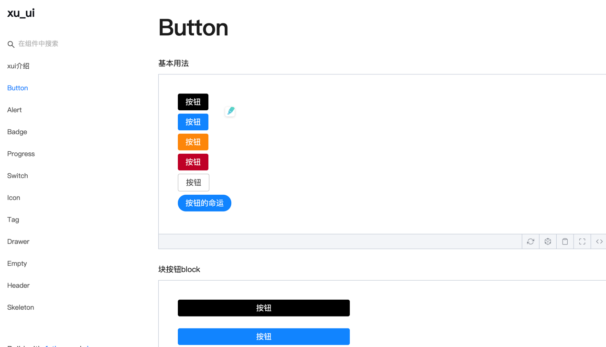
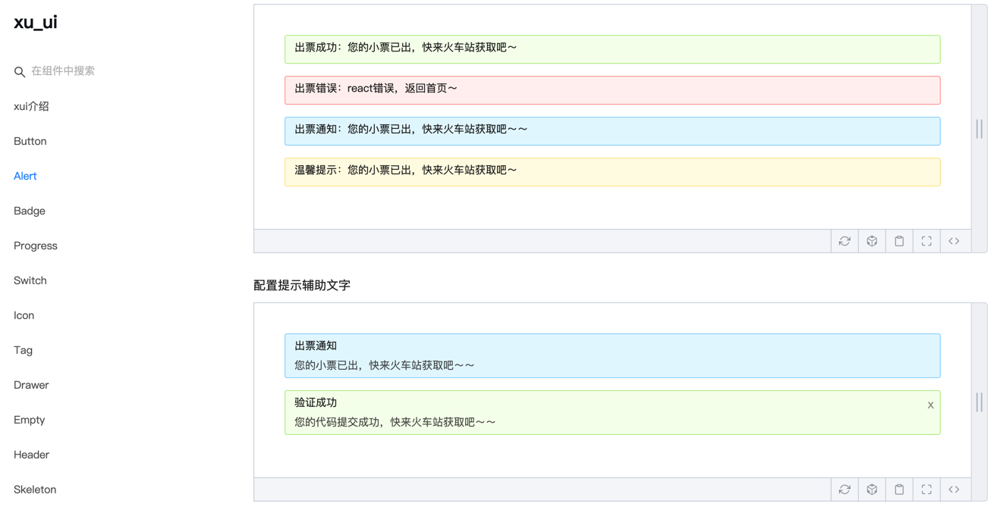
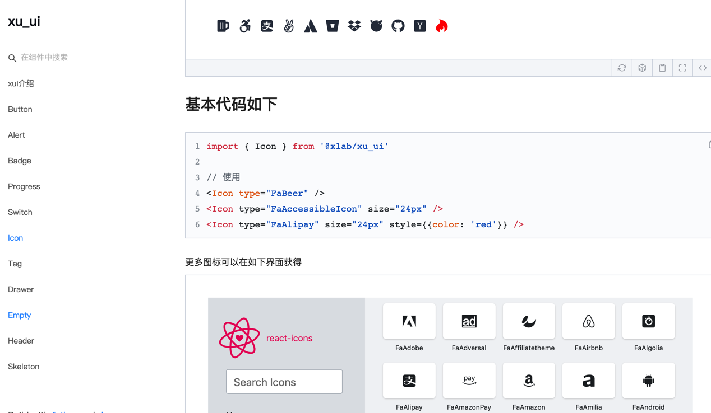

# xui——基于react的轻量级UI组件库
xui是笔者开发的基于react的轻量级组件库，目前不依赖任何第三方ui组件库，支持按需导入，可定制。官网地址website: [xui——基于react的轻量级UI组件库](https://mrxujiang.github.io/xu_ui/)

如果觉得官网地址访问太慢，可以直接移步github地址：[xui——基于react的轻量级UI组件库](https://github.com/MrXujiang/xu_ui)

目前已开发完成如下ui组件：
* Button 按钮组件
* Badge 徽标数组件
* Alert 警告提示组件
* Drawer 抽屉组件
* Progress 进度条组件
* Switch 开关组件
* Tag tag标签页组件
* Modal 轻量实用的模态窗组件
* Icon组件（基于react-icons的二次封装）
* Input 输入框组件
* Spin 加载组件
* Notification 通知提示
* Message 消息提示框组件
* Empty 空状态组件
* Skeleton 专为个人网站准备的骨架屏组件

正在开发的组件：
* Form form表单组件
* Table 列表组件
* Menu 菜单组件
* DropDown 下拉框组件

后续会开发出更多优质轻量组件，敬请关注。

# 技术实现与版本
该组件库基于一下技术版本开发：
* react: 16.8.6
* react-dom: 6.8.6
* classnames

# 文档demo演示




# 使用

## 1.安装
``` js
npm install @alex_xu/xui
```
或者用yarn安装
``` js
yarn add @alex_xu/xui
```
## 2. 使用
``` jsx
import { 
  Button,
  Skeleton,
  Empty,
  Progress,
  Tag,
  Switch,
  Drawer,
  Badge,
  Alert
} from '@alex_xu/xui'
import { useState } from 'react'
import styles from './index.css'

export default function() {
  const [visible, setVisible] = useState(false)
  let show = () => { setVisible(true)}
  let close = () => { setVisible(false)}
  return (
    <div className={styles.normal}>
      <Button className={styles.btn}>default</Button>
      <Button className={styles.btn} type="warning">warning</Button>
      <Button className={styles.btn} type="primary">primary</Button>
      <Button className={styles.btn} type="info">info</Button>
      <Button className={styles.btn} type="pure">pure</Button>
      <Button className={styles.btn} type="primary" shape="circle">circle</Button>
      <Button className={styles.mb16} type="primary" block>primary&block</Button>
      <Button type="warning" shape="circle" block onClick={show}>circle&block</Button>
      {/* <Skeleton /> */}
      <Progress
        percent={10}
      />
      <Progress
        percent={50}
        themeColor="#009933"
      />
      <Progress
        percent={50}
        width={240}
      />
      <Progress
        percent={30}
        width={240}
        textColor="#fff"
      />
      <Progress
        percent={50}
        width={200}
        themeColor="#FF6666"
        hiddenText
      />
      <Progress
        percent={10}
        themeColor="#6699FF"
        statusScope={[[18, 'red'], [40, 'orange']]}
      />
      <Progress
        percent={20}
        themeColor="#6699FF"
        statusScope={[[18, 'red'], [40, 'orange']]}
      />
      <div className={styles.mb16}></div>
      <Tag>Html</Tag>
      <Tag closable>react</Tag>
      <Tag color="#FF99CC">Css3</Tag>
      <Tag color="#06c" closable>react</Tag>
      <Tag color="rgb(135, 208, 104)">Node</Tag>
      <div className={styles.mb16}></div>
      <Switch onText="on" offText="off" size="small" />
      <Badge text="ddd" status="warning">6666ngd</Badge>
      <div className={styles.mb16}></div>
      <Alert message="success tip" />
      <Alert message="success tip" type="success" />
      <Alert message="success tip" type="error" />
      <Alert message="success tip" type="info" />
      <Alert message="success tip" type="info" closable />
      <Alert message="success tip" description="skfjdsalajdfjadkfjaldfhjaskdn你好,欢迎光临" closable type="success" />
      <Empty />
      <Drawer visible={visible} onClose={close} destroyOnClose>
        <h3>我是标题</h3>
        <br/>
        <input type="text"/>
        <br />
        <textarea />
      </Drawer>
    </div>
  )
}

```

# API文档
正在搭建中，具体使用方式可参考：
* [手摸手实现一个轻量级可扩展的模态框(Modal)组件](https://juejin.im/post/5e416e78e51d45270f52b062)
* [《精通react/vue组件设计》之配合React Portals实现一个功能强大的抽屉(Drawer)组件](https://juejin.im/post/5e3e7b8fe51d4526fb5dcddb)
* [《精通react/vue组件设计》之5分钟实现一个Tag(标签)组件和Empty(空状态)组件](https://juejin.im/post/5e3cc898e51d4526d87c6037)
* [《精通react/vue组件设计》之用纯css打造类materialUI的按钮点击动画并封装成react组件](https://juejin.im/post/5e35294d518825263237f3ba)
* [《精通react/vue组件设计》之快速实现一个可定制的进度条组件](https://juejin.im/post/5e366772f265da3e307710dd)
* [《精通react/vue组件设计》之基于jsoneditor二次封装一个可实时预览的json编辑器组件(react版)](https://juejin.im/post/5e302af8e51d453cc04abc56)

# 技术交流与反馈
微信（wechat）：qunqiujinkou

欢迎提出更多issue以便让组件库更健壮

